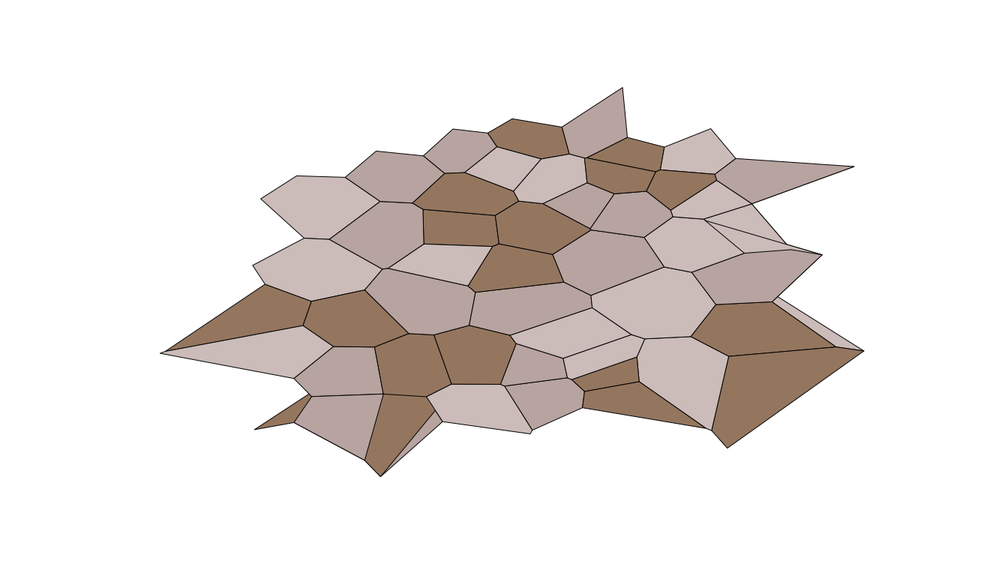

<h1>Map Generator</h1>

</img>

<h2>Description</h2>

In this notebook I try to generate a map using Voronoi polygons (reference below).

To obtain more regular shapes I use a variant of the Lloyd relaxation algorithm: for every polygon I take all the vertices and calculate the centroids. In this case I applied this method once, but you can tweak the parameter <i>times</i> to have a bit different results.

I'm not very satisfied with the result, but I found some problems in doing this with Python, while I found a lot of projects written in other language maybe more suitable (C++, C# or Javascript, especially for textures and noise).

I'll probably try a more standard approach, like <b>heightmaps generation</b> and the <b>Diamond-square algorithm</b>. Don't know yet.

<h2>Reference</h2>
<ul>
    <li><a href="http://www-cs-students.stanford.edu/~amitp/game-programming/polygon-map-generation/">Polygonal Map Generation for Games</a></li>
    <li><a href="https://scipy.github.io/devdocs/generated/scipy.spatial.Voronoi.html">Voronoi Scipy's library</a></li>
    <li><a href="https://www.programcreek.com/python/example/91993/scipy.spatial.Voronoi">Some useful scripts that work on Voronoi polygons</a></li>
</ul>
